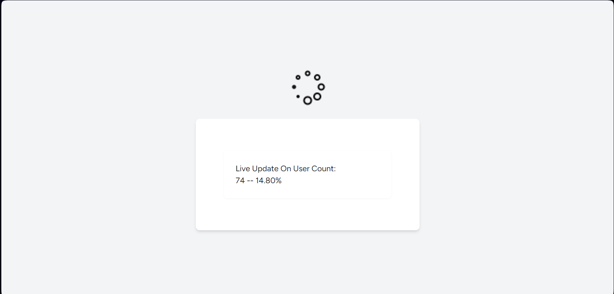
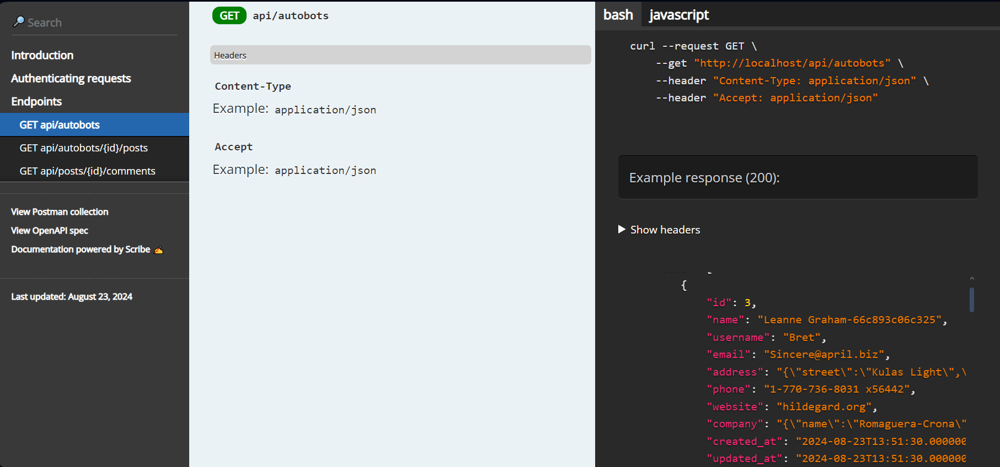
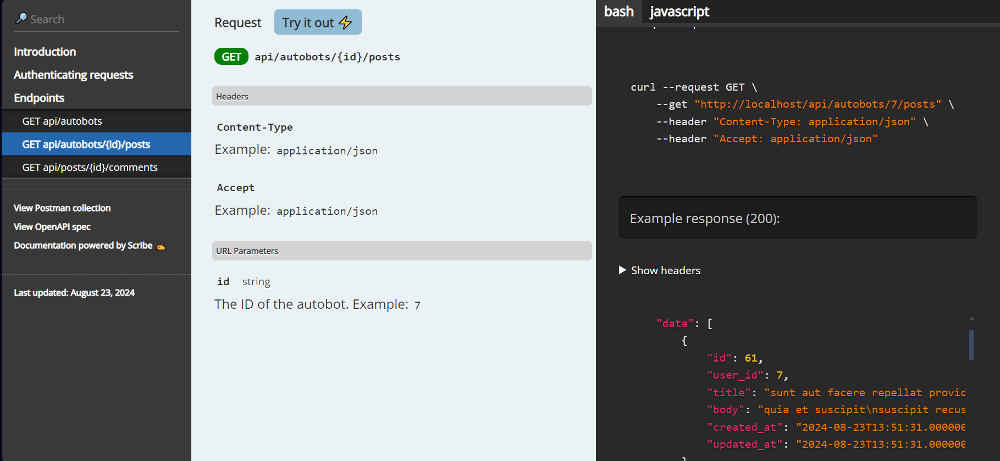
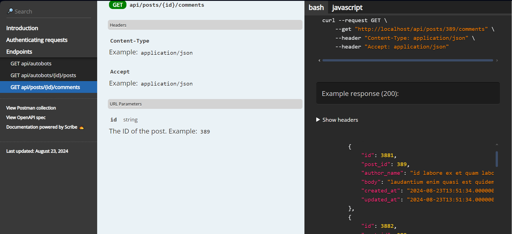

# SmartInsight

This Project is for the SmartInsight Assesment Question. Which creates 500 Autobots users along with its associated posts and comment for every batch(1 hour).this solution uses techonogy laravel Reverb websockets to broadcast events live 

### The .env.example file contains sensitive info about this web app such as app key, reverb credentials etc because of ease of configurtion and this project only being a demo more or so project.

## Table of Contents

- [Installation](#installation)
- [Configuration](#configuration)
- [Usage](#usage)
- [API Documentation](#api-documentation)
- [Testing](#testing)
- [Deployment](#deployment)
- [Contributing](#contributing)
- [License](#license)

## Installation

### Prerequisites

- [PHP](https://www.php.net/downloads) (version >= 8.1)
- [Composer](https://getcomposer.org/)
- [Node.js](https://nodejs.org/) and npm
- [MySQL](https://www.mysql.com/) or [PostgreSQL](https://www.postgresql.org/)

### Steps

1. Clone the repository:

```bash
    git clone https://github.com/your-username/your-repository.git
```
2. Navigate into the project directory:

```bash
    cd your-repository
```

3. Install dependencies:

```bash
composer install
npm install
```
4. Copy the .env.example file to .env:

```bash
cp .env.example .env
```

5. Generate the application key:

```bash
php artisan key:generate
```
6. Set up your database in the .env file:
```bash
.env
DB_CONNECTION=mysql
DB_HOST=127.0.0.1
DB_PORT=3306
DB_DATABASE=your_database
DB_USERNAME=your_username
DB_PASSWORD=your_password
```
7.Run the database migrations:
```bash
php artisan migrate
```
8. Start the local development server:
```bash
php artisan serve
```
9.Compile the assets:

```bash
npm run dev
```

###Usage

Accessing the Application
Open your browser and navigate to http://127.0.0.1:8000.

Running Artisan Commands
Start WebSocket Reverb:
```bash
php artisan reverb:start

or

php artisan reverb:start --debug
```

Start Queue for Data Seeding:
```bash
php artisan queue:work --queue=seeding
or 
php artisan queue:listen --queue=seeding
```
Start Queue to Broadcast Events:
```bash
php artisan queue:work
```
Running the Autobot Job Manually
If you're developing on Windows, you can manually start the Autobot creation process using the following command. Note that in production, this job should be scheduled to run hourly.

```bash
php artisan app:autobots-job
```

Configuring the Cron Job on Linux
To automate the Autobot creation process on a Linux server, you can set up a cron job. Here's how:

Edit the Crontab File:

Open the crontab file for editing:
```bash
crontab -e
```
Add the Cron Job:

Add the following line to schedule the job to run every hour:

```bash
0 * * * * /usr/bin/php /path-to-your-project/artisan app:autobots-job >> /dev/null 2>&1
```

Replace /usr/bin/php with the path to your PHP binary if it's different.
Replace /path-to-your-project/ with the absolute path to your Laravel project.
Save and Exit:

Save the crontab file and exit. The job will now run automatically every hour.

Note: Ensure that your app:autobots-job command is properly configured to run without requiring user interaction and that it logs any errors for troubleshooting.

API Documentation
API documentation is generated using Scribe.

To generate the API docs, run the following command:
```bash
    php artisan scribe:generate
```
The API (Rate limit to 5 requests per minutes)Endpoints for Developer consumptions are :
```bash
i. http://127.0.0.1:8000/api/autobots   to get list of users resources
ii. http://127.0.0.1:8000/api/autobots/{id}/posts  to get list of post resources pagnated
iii. http://127.0.0.1:8000/api/posts/{id}/comments  to get list of comment resources paginated
```

The API documentation can be accessed at:
url
```bash
    http://127.0.0.1:8000/docs
```



